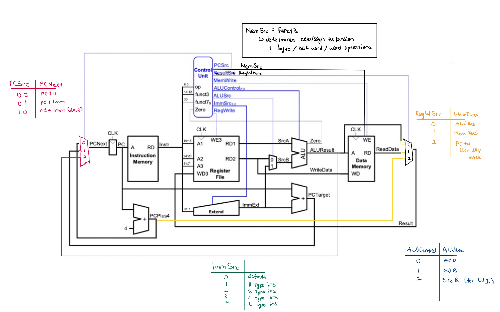
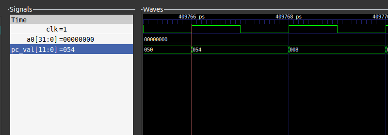
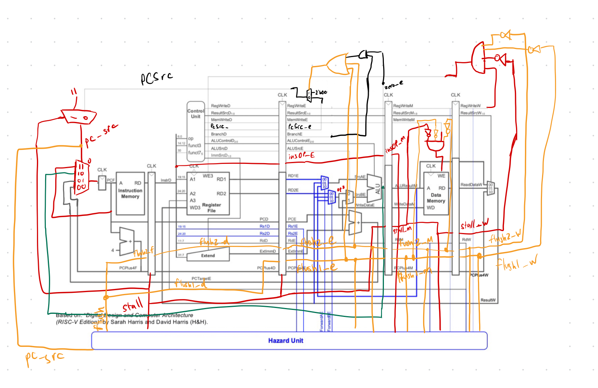
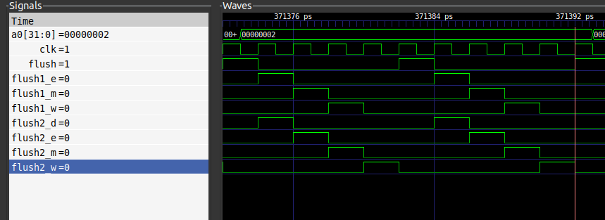
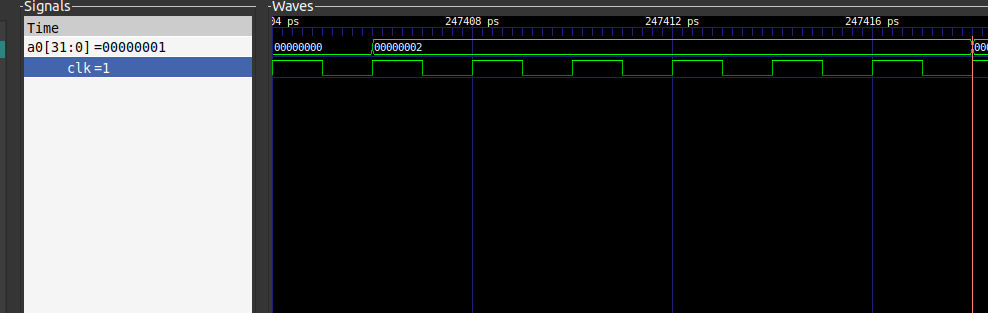

# Personal Statement: Jay

## Overview of the components I worked on:

**************Single cycle:**************

- [Top level file](#top-file)
- [Testbench](#testbench)
- [Testing of the CPU with the f1 and reference program](#testing-with-the-f1-and-reference-program)

**************Pipeline:**************

- [Hazard Unit](#hazard-unit)
- [Testing of the pipelined CPU with the f1 and reference Program](#testing-with-the-f1-and-reference-program-1)

**NOTE**: For the [commit](https://github.com/johnyeocx/iac-project-team02/commit/5e5b21f507515ffcec1434028997f73127895389), the message “changed the flush and fixed the data memory” should say **“changed the flush and fixed the register file”**

## Single Cycle

### Top File



The schematic for the RISC V single cycle processor we agreed on together is shown above. I will explain the decisions made below.

An extra control signal from the control unit to the data memory was required as the data memory had no way of telling whether an instruction is a load/store word, half word or byte, which all requires data to be presented differently at the output or written in a specific way into memory.

The multiplexor whose output is connected to the register file’s data input (******WD3******) is used with the `JALR` instruction, to store PCPlus4 in a register, and an extra control signal is used to determine if the value written to the register should be the Result signal (the ALU result or the output of the data memory) or PCPlus4.

The multiplexor that determines the value of PCNext required at least 1 more input, to implement the `JALR` instruction, since it requires the output of the ALU to be written into the program counter.

When writing the top file ([link to commit](https://github.com/johnyeocx/iac-project-team02/commit/9d5831b4361b3cbae0243e3257e1ecbfe4270f9e#diff-eba8aecac1d84bfb53115d6fbac397c94c702f07a980e8a9ef4268dedf1fee08R45)), the signal `ImmExt` had to be truncated to 12 bits (the width of `PC`) to add it to `PC` since the sum refers to a memory address in the instruction memory, where the address width is 12 bits, the more significant bits have no meaning hence can be truncated. 

## Testbench

The testbench for this project has been split into 2 separate testbenches, one for the f1 program and the other for the reference program. Both testbenches have `rst = 1` for the first 3 clock cycles to ensure the value of the program counter is at 0 when it begins.

The testbench used to run the f1 program has been kept simple, it creates the .vcd file to record the signals at every change in the value of the clock, which has been useful for debugging (also used in the testbench for the reference program). Additionally, it has been made to run the f1 program immediately and display the value of register a0 and clock cycle on the VBuddy.

The testbench for the reference program was more challenging as it had to detect the end of the build operation, and then display the result on the VBuddy. Initially ([link to commit](https://github.com/johnyeocx/iac-project-team02/commit/660a2bc535181fbe11ef14e1d03cda04eecae71a)), I ran the simulator with the lines calling the VBuddy commented out in the main loop, then used the waveform produced to find the clock cycle when the display subroutine starts. Using the value of the clock cycle, I implemented the code shown below to plot the value of a0 on the VBuddy after the clock cycle found had been reached.

```cpp
if(simCycle > 123703){
	vbdPlot(top->a0, 0, 255);
	vbdCycle(simCycle+1);
} 
```

However, when testing with other data sets, such as noisy.mem, the output remained at 0, as the build operation takes longer to complete. This can be seen in the image below, which shows the result with the noisy.mem dataset, the first display instruction occurs when PC = 0x54, which occurs at clock cycle 204883 (1ps = 0.5 clock cycles on GTK wave).



To overcome this ([link to commit](https://github.com/johnyeocx/iac-project-team02/commit/9a46165b56321e6f64079ff34710f7037e90ed9e)), I set the initial value of a0 to 0 in the register file using `regs['d10] = {DATA_WIDTH{1'b0}}`, within `inital` statement, to ensure it is always 0 on start-up. The build and init subroutine do not change the value of a0, a0 will only change when a value is being displayed, hence, the testbench only needs to check when the value of a0 is not 0. To ensure that it continues to display a0 if it becomes 0 again, a flag is used: `bool show_signal = false`. The code below has been added to the main loop in the testbench, when the value of a0 changes, it ensures the flag is always set to `true`. This will always plot a0 once a0 has changed from 0.

```cpp
if(show_signal || top->a0 != 0){
	vbdPlot(top->a0, 0, 255);
	vbdCycle(simCycle+1);
	show_signal = true;
}
```

## Bash Scripts

The Bash scripts have been kept simple, the only extra complexity I added to them was to use the stream editor to prevent bugs when testing. This is a problem I found with John, when testing on his computer, we had forgotten to add the offset when loading the data memory for the reference program. To change the program run, different hex files must be loaded into the instruction memory, this is done in the f1 bash script using the line shown below. This line ensures it always changes line 10 of the instruction_memory.sv file to load the f1 instructions in f1.hex.

```bash
sed -i '10 s/.*/    initial $readmemh("test\/f1.hex", instr_arr);/' rtl/control/instruction_memory.sv
```

Equivalent lines have been written in PDF (to run the reference program) bash script and to change the data memory loaded, it uses the first argument given when running to determine which memory to load into the data memory, however, it defaults to Gaussian if the argument provided does not match any of the other options. The code that performs this is shown below.

```bash
data_mem="gaussian"

if [[ $1 = 'sine' ]]
then
    data_mem="sine"
elif [[ $1 = 'noisy' ]]
then
    data_mem="noisy"
elif [[ $1 = 'triangle' ]]
then
    data_mem="triangle"
fi

sed -i '17 s/.*/    initial $readmemh("test\/'$data_mem'.mem", data_mem_arr, '"'"'h10000);/' rtl/control/data_memory.sv
```

## Testing with the F1 and Reference program

For the initial testing ([link to commit](https://github.com/johnyeocx/iac-project-team02/commit/9d5831b4361b3cbae0243e3257e1ecbfe4270f9e#diff-930ba83de9204454ec64194b9e4364002b91de3c5b767158c134ad784c9f4b29)), I tried to simply compile all of the System Verilog files, where I encountered syntax errors in all of the files, which I corrected, it would have been better to get my teammates to test if there code compiles as they wrote it, which we did when developing the later stages.

I searched for logic errors using the GTK wave and the f1 program ([link to commit](https://github.com/johnyeocx/iac-project-team02/commit/f65772f033db698e08b4c2088e4b99a390ded7c0)), which was useful as I could see the values of each signal for every instruction that ran, and it helped me catch a lot of bugs in the different modules, such as in the register file, register a0 was found using `assign a0 = regs['h10]`, however, a0 is stored at index 10 in decimal, which is 0xA, hence I changed it to `assign a0 = regs['d10]`.

In the control unit, `BNE` was not implemented correctly ([fixed in commit](https://github.com/johnyeocx/iac-project-team02/commit/f65772f033db698e08b4c2088e4b99a390ded7c0)), I noticed this as the program would not branch when the 2 operands of the ALU are different, this is since it was implemented as `7'b1100011: PCSrc = Zero ? 2'b01 : 2'b00`, when PCSrc = 0, the program counter moves to the next instruction, it does not branch. This was solved by simply swapping the values: `7'b1100011: PCSrc = Zero ? 2'b00 : 2'b01`. `JALR` also did not jump to a new address, since, PCSrc had been implemented as `7'b1100111: PCSrc = 2'b11` for `JALR`, where the PCSrc = 3 is not defined (as seen in the image of the top file design at the very top of this personal statement), hence it was solved by changing it to: `7'b1100111: PCSrc = 2'b10;`. For this case, as 3 was not defined for PCSrc, it defaulted to increment the program counter by 4, due to the way the PC multiplexor was implemented.

I also changed the if statement for the sign extension unit ([in this commit](https://github.com/johnyeocx/iac-project-team02/commit/f65772f033db698e08b4c2088e4b99a390ded7c0)), the new version is shown below, it now uses an else statement instead of specifically defining the value for the condition when ImmSrc = 0, this is since, the total number of possible values when using 3 bits is 8, however only 5 of the values are defined in our implementation (0 to 4), hence, if an error does occur and ImmSrc becomes 5, 6 or 7, the else statement would run, handling the error in a safer way. 

```sv
if (ImmSrc == 3'd1) ImmExt = {{19{msb}}, Imm[31], Imm[7], Imm[30:25], Imm[11:8], 1'b0}; // B Type Ins
else if (ImmSrc == 3'd2) ImmExt = {{20{msb}}, Imm[31:25], Imm[11:7]}; // S Type Ins
else if (ImmSrc == 3'd3) ImmExt = {{11{msb}}, Imm[31], Imm[19:12], Imm[20], Imm[30:21], 1'b0}; // J Type Ins
else if (ImmSrc == 3'd4) ImmExt = {Imm[31:12], 12'b0}; // LUI Ins
else ImmExt = {{20{msb}}, Imm[31:20]};
```

I also found that we had not implemented the `SUB` instruction and that the control unit and ALU were incompatible, this was most likely due to a miscommunication ([solved in commit](https://github.com/johnyeocx/iac-project-team02/commit/5a33fd0a884a8cbd39b7b08b4a028a85465eb309)). I solved this by correctly implementing the ALUSrc based on the table below, which is what we agreed on as a team, the code which implements this in the control unit is shown under the table. For all other instructions, that are not `LUI`, `ADD` or `SUB`, ALUControl will be 000, this ensures there is no random and unpredictable behaviour, making it easier to debug.

| ALUSrc | Instruction |
| --- | --- |
| 000 | ADD |
| 001 | SUB |
| 010 | LUI |

```sv
ALUControl = (op == 7'b0110111) ? 3'b010 : (funct7 == 7'b0100000 ? 3'b001 : 3'b000);
```

I was also required to change the implementation in the ALU, which is shown in the code below. Since there are not enough cases to match the width of ALUControl, it requires 8 but there are only 3 defined; for cases 0 and 3 to 7, the output will be the sum of the inputs, to ensure the behaviour of the circuit is controlled if an error occurs.

```sv
case(ALUctrl)
	3'b001: SUM = op1 - op2;
	3'b010: SUM = op2;
	default: SUM = op1 + op2;
endcase
```

After completing these steps, the F1 program ran successfully, as the correct signals were asserted for the instructions that ran, however, this did not mean that all instructions implemented were implemented correctly since it did not use `LUI`, `SB` and `LBU`. These instructions were used in the reference program hence, I used it to check if they assert the correct signals, finding the `LUI` instruction was not writing to a register, and that was due to a missing condition in the if statement that defines the WE signal for the register file (RegWrite), the condition added is shown below.

```sv
if (
	op == 7'b0110011 
	|| op == 7'b0010011
	|| op == 7'b0000011
	|| op == 7'b1100111 
	|| op == 7'b1101111 
	|| op == 7'b110111  // LUI - this is the only condition I added
) RegWrite = 1;
else RegWrite = 0;
```

After this, all instructions asserted the correct signal when executed, which was confirmed by checking the waveform for each different instruction. However, I do think I could have tested this in a better way. I believe it would have been better, faster and more reliable if I had tested each component individually, creating a test bench for each and a shell file to run them. This would have debugging as it wouldn’t require me to figure out which instruction is running on each clock cycle and whether consider whether the signals it asserts are correct. This is something which I do more of when testing the pipeline processor.

## Pipeline

### Hazard Unit

The schematic I designed shows the connections required on the top level file to implement the hazard unit:



To approach the hazard unit, I broke it down into 3 stages:

- forwarding (blue wires)
- stalling (red wires)
- flushing (orange wires)

The green wire used is for the JALR instruction, implemented in the same way as the single cycle.

Explanation of signals:

| Signal | When signal has a value 1, it indicates… |
| --- | --- |
| stall | in the next cycle, a stall has occurred: the value calculated at the execute stage is incorrect and the value needed is being fetched from the data memory. |
| stall_m | this stage is stalled, it contains wrong information, hence should not write data |
| stall_m | this stage is stalled, it contains wrong information, hence should not write data |
| flush | the fetch and decode stages contain the wrong information - this signal should propagate through the different stages |
| flushX_Y (X = fetch(2) or decode(1), Y = stage) | this stage is being flushed, do not change the state of the CPU (execute branch, jump, forward or write to memory or registers) |

**Forwarding**

The 2 blue multiplexors in the execute stage have been chosen to be implemented in the way shown below:

| FowardAE/ForwardBE | Multiplexor Output |
| --- | --- |
| 00 | Value stored in register, received from the decode stage |
| 01 | Value to be written to the register file at the write stage  |
| 10 | The ALU result from the memory stage |

To forward values, the multiplexor simply requires logic change the values of `ForwardAE` and `ForwardBE`. I initially implemented ForwardAE ([link to commit](https://github.com/johnyeocx/iac-project-team02/commit/c5c98eed1b90206229f23fb282846224ce82c7c2)) in the way show below (ForwardBE was implemented equivalently with `Rs2E` instead of `Rs1E`), before considering the effects of stalling and flushing. The first condition of the if statement is specific to stalling, it prioritises forwarding the write stage value. It also checks if the value in the memory stage should be forwarded, this is checked before the write stage to ensure only the most recent value is forwarded, then it checks if the wire stage should be forwarded and if neither are true, uses the values found from the register file. 

******************OLD code:******************

```sv
if(stall_m == 1 && Rd_w == Rs1_e) ForwardAE = 2'b1;
else if(RegWriteM && RdM == Rs1E) ForwardAE = 2'b10;
else if(RegWriteW && RdW == Rs1E) ForwardAE = 2'b1;
else ForwardAE = 2'b0;
```

Whilst implementing the stall and flush ([link to commit](https://github.com/johnyeocx/iac-project-team02/commit/5e5b21f507515ffcec1434028997f73127895389)), I realised that when a stage is being stalled or flushed, indicated by the flush or stall signal for the stage (e.g. flush2_m = 1 indicates the memory stage is being flushed), forwarding should not occur, which I prevent by adding extra conditions to ensure the stage which is forwarding a value is not in a stall or flush state, using the code below.

```sv
// starts by checking if the ALUResult from the m stage should be forwared
else if(flush1_m == 0 && flush2_m == 0 && stall_m == 0 && RegWrite_m && Rd_m == Rs1_e) ForwardAE = 2'b10;
// checks if the Result_w value should be forwarded
else if(flush1_w == 0 && flush2_w == 0 && stall_w == 0 && RegWrite_w && Rd_w == Rs1_e) ForwardAE = 2'b1;
```

This makes the if statement shown below redundant (this has been removed in [this commit](https://github.com/johnyeocx/iac-project-team02/commit/6f5e3e28b28c439c91f5f1848a80fa2f50f10208)).

```sv
if(stall_m == 1 && Rd_w == Rs1_e) ForwardAE = 2'b1;
```

****Stalling****

Firstly, the condition to indicate a stall is implemented in the code shown below, if the `LBU` instruction is at the memory stage and the register it will load the data into is used by the execute stage, a stall has happened. This is implemented in [this commit](https://github.com/johnyeocx/iac-project-team02/commit/c5c98eed1b90206229f23fb282846224ce82c7c2#diff-335ac708a1d5853dc8065daac5f19c88dc54a2e6b930322614f7e7ba37f0ba53), however, additional conditions are added in the flushing stage (explained with flushing). 

```sv
if(insOpM == 7'b0000011 && (RdM == Rs1E || RdM == Rs2E)) stall = 1;
else stall = 0;
```

To determine what should happen in the clock cycles after `stall = 1`, I broke it down into these stages and considered the parts of the stages that change the state of the CPU:

- Memory (1 clock cycle after `stall = 1`):
    - writes to the data memory
    - forwards values to the execute stage
- Write stage (2 clock cycles after `stall = 1`):
    - writes to the register file
    - forwards values to the execute stage

The decode and write stages are the only stages effected since in the clock cycle after stall = 1, the memory stage will contain the incorrect result, and this moves to the write stage in the next clock cycle.

This stall signal propagates through the decode and write stages, this is used with logic gates on the top level sheet to ensure the WE signal is set to 0, for the data memory and register file.

Forwarding has been taken care of.

An extra multiplexor has also been included on the top level sheet to ensure the program counter remains the same value, and the pipeline stages receive the stall signal and only change value when `stall = 0`, which I added to the pipeline stages John wrote, a mistake on my part for not explaining to him the role of the stall signal.

**Flushing**

At first, I accidently implemented this in a way that causes the memory and write stages to be flushed ([in this commit](https://github.com/johnyeocx/iac-project-team02/commit/ba83ee3425384e11da2908e47f6cf253cb44fb85)), which is incorrect, however I fixed this ([in this commit](https://github.com/johnyeocx/iac-project-team02/commit/5e5b21f507515ffcec1434028997f73127895389)) and will explain this implementation below.

The logic to determine whether the fetch or decode stages should be flushed is shown below. The execute stage is the stage where a Jump or Branch changes the value of the program counter, hence, at this stage, it detects if the program counter is being change, and this indicates that the fetch and decode stages contain incorrect data and should not change the state of the CPU. Since they should not change the state of CPU, the if statement first checks if the instruction on the execute stage is being flushed or stalled (as if stalled, the execute stage will contain the wrong information, hence will not be able to decide if it should branch/jump or not). 

```sv
if(flush1_e == 0 && flush2_e == 0 && stall == 0 &&(pc_src == 2'b1 || pc_src == 2'b10)) flush = 1;
else flush = 0;
```

To determine what should happen at each stage for an instruction that is being flushed, I approached this problem in a similar way to stalling, by checking each stage the flushed instruction visits after the clock cycle where flush = 1, and identified the parts where the state may change:

- Decode: no changes of state of the CPU
- Execute:
    - PC value may changes, ensure this does not happen
- Memory:
    - creates stall
    - writes to data memory
    - forwards values to the execute stage
- Write:
    - writes to register file
    - forwards values to the execute stage

Writing to data memory, register file and ensuring PC value doesn’t change has been implemented in similar ways, by adding extra logic in the top level file.

Forwarding values has been sorted in the forwarding section.

Ensuring a stall does not occur requires the logic for when a stall happens to be changed, which I did on [this commit](https://github.com/johnyeocx/iac-project-team02/commit/5e5b21f507515ffcec1434028997f73127895389#diff-335ac708a1d5853dc8065daac5f19c88dc54a2e6b930322614f7e7ba37f0ba53), the code changed ensures that it does not stall when the memory stage is being flushed, this is shown below.

```sv
if(insOp_m == 7'b0000011 && (Rd_m == Rs1_e || Rd_m == Rs2_e) && flush1_m == 0 && flush2_m == 0) stall = 1;
```

## Testing the control unit

The ALU used in the single cycle has been copied over from the single cycle, hence it has been verified to work. However, the control unit has been modified by John, hence, I have created the truth table shown below to test it.

| INS | OP | funct3 | funct7 | ImmSrc | PCSrc | ALUControl | ALUSrc | MemWrite | MemSrc | RegWrite | RegWSrc | Branch |
| --- | --- | --- | --- | --- | --- | --- | --- | --- | --- | --- | --- | --- |
| JAL | 1101111 | x | x | 11 | 01 | x | x | 0 | x | 1 | 10 | 0 |
| JALR | 1100111 | 000 | x | 0 | 10 | 000 | 1 | 0 | x | 1 | 10 | 0 |
| SB (Store Byte) | 0100011 | 000 | x | 10 | 00 | 000 | 1 | 1 | 00 | 0 | x | 0 |
| LBU (Load unsigned byte) | 0000011 | 100 | x | 00 | 00 | 000 | 1 | 0 | 00 | 1 | 01 | 0 |
| ADD | 0110011 | 000 | 0000000 | x | 00 | 000 | 0 | 0 | x | 1 | 00 | 0 |
| ADDI (Add immediate) | 0010011 | 000 | x | 000 | 00 | 000 | 1 | 0 | x | 1 | 00 | 0 |
| LUI (Load upper immediate) | 0110111 | x | x | 100 | 00 | 010 | 1 | 0 | x | 1 | 00 | 0 |
| BNE (Branch not equals) | 1100011 | 001 | x | 001 | 01 | x | x | 0 | x | 0 | x | 1 |
| SUB | 0110011 | 000 | 0100000 | x | 00 | 001 | 0 | 0 | x | 1 | 00 | 0 |

I created a function to test each signal, the code for it is shown below. The `signal` is the output of  a specific signal of the control unit after the inputs have been applied, `ans` is the result that is expected, found using the table above. -1 has been used to implement don’t cares since the binary output of the signals will always be small enough to only be a positive integer when interpreted in C++.  

```cpp
void testResult(int signal, int ans, int ins, std::string signal_name){
    if(ans == -1) return;
    else if(signal == ans) return;
    else std::cout << "failed on instruction: " << ins << " | on signal: " << signal_name << " | expected: " << ans << " | got: " << signal <<  std::endl;
}
```

This produced some errors and I had to change some of the code in the control unit, however, I found this method to make it faster and easier to solve problems with the control unit, as I could see all the conditions not met in one place, rather than trying to fix the existing code, it is easier to see if the entire code block should be replaced. This test and fixes can be found at [this commit](https://github.com/johnyeocx/iac-project-team02/commit/a417698735cc9e147a600d73762a2e780e4ed9aa#diff-d66285f26ac0a13197be807036a96d12f68c542228f48cd75cda0bb50f79d174).

After implementing this test, I also used it to test the control unit on the single cycle, making some adjustments to the truth table, as the control unit on the single cycle has the input zero and does not have a branch ouput. This can be found in [this commit](https://github.com/johnyeocx/iac-project-team02/commit/7a41ccdbcd3137c83e3873f4e1d6cb64dd4bdb6b).

## Testing with the f1 and reference program

In a similar fashion to the single cycle, I completed the testing for the pipelined CPU by checking whether the correct signals are asserted when both the f1 and pdf program were run. I found that register `zero` was being written to and it’s value changed, hence, to fix this I added an extra condition to the if statement to the register file, which was present in the single cycle, however, the pipelined CPU was started before the single cycle was complete, hence, some of the changes made were not carried over.

```sv
if(WE3 && Rd_w != 0) regs[Rd_w] <= Result_w;
```

The correct results were observed in the waveforms when the f1 program and the reference program were run, and the output displayed correctly on the VBuddy. However, for the pipelined processor, each value of a0 has been stretched in the horizontal direction. This can be seen in the waveforms below.

The pipelined processor, displays the value 0x2 for 10 clock cycles:



The single cycle processor, displays the value 0x2 for 6 clock cycle:



From waveforms above, it is clear that the first instruction after branching only writes to a register after the final instruction is flushed, which results in extra clock cycles, moving the flushed instructions through the different stages of the processor, whilst in parallel, running operations to execute the next instructions after the branch instruction. Hence, the stretching in the horizontal axis is to be expected for the pipelined implementation.

## Conclusion

This project has been really enjoyable and has helped me better understand the RISC V ISA, as we’ve been able to implement the CPU from scratch and make our own design decisions along the way based on how what we believe the best way to implement the ISA of the RISC V is.

To improve on this project, testing the modules independently, using the method I used for the control unit when testing the pipelined CPU would have made it easier to spot and resolve bugs, as well as more thoroughly test components, to ensure they are more robust. This would also be important if we were implementing all the instructions, since some instructions are not used in the f1 and reference program, the only way to validate if they work is through the testing on the individual modules, creating test cases for for each instruction. 

Communicating more with my team, I believe, would have reduced the number of issues that would have occurred when testing and is something which I have gotten better at over the course of this project, which reduced the number of errors we had towards the end.