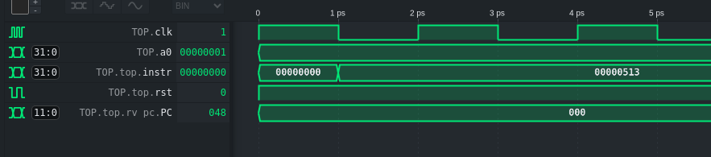

# Debugging the f1 program

After running the test bench - F1 program compiled successfully and instrcutions loaded into memory correctly

since the word for the first instruction `addi    a0, zero, 0x0 ` is 00000513

which is the instruction fetched from memory (the output of the instruction memory):

main errors when pulling things togther were with the compatibity with the modules and the control unit

For the PDF -> had to add support for the LUI ins in the control unit - to ensure RegWrite = 1 